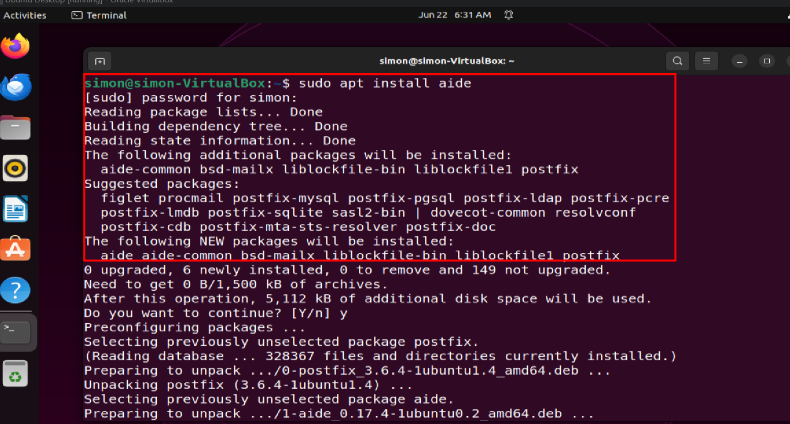
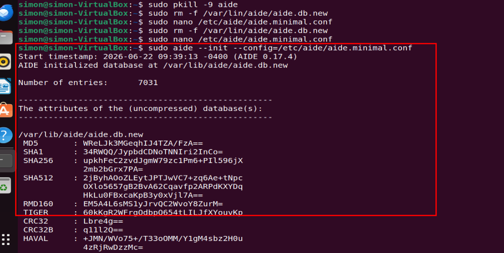
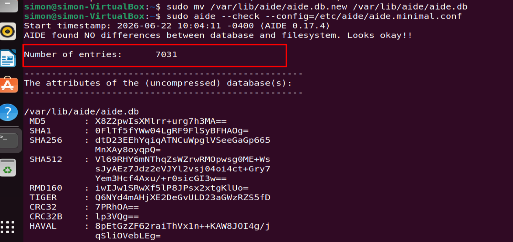
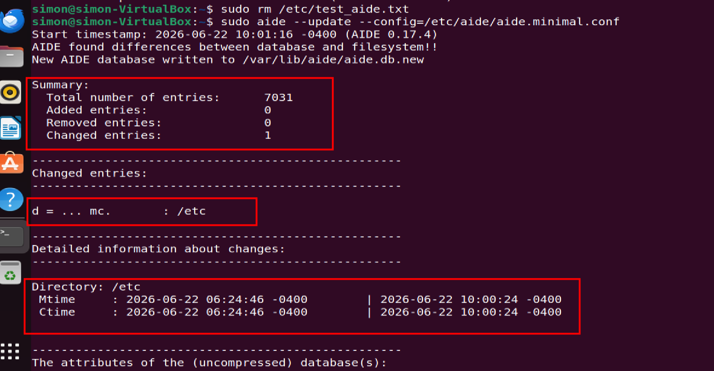
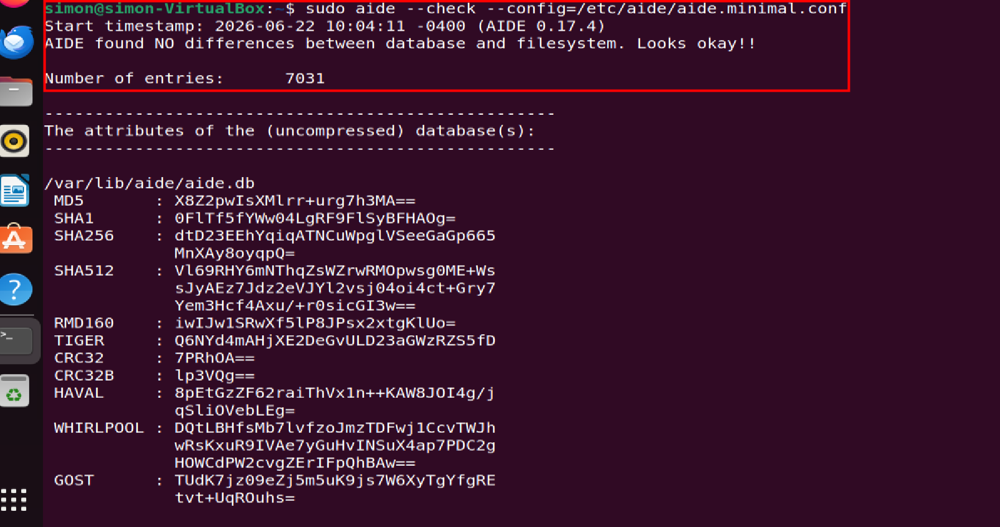

# AIDE File Integrity Monitor - VirtualBox Optimized

Minimal AIDE setup for Ubuntu on VirtualBox that fixes the "0 bytes database + frozen scan" problem.

## Objective
Implement reliable file integrity monitoring using AIDE on Ubuntu VirtualBox. Detect unauthorized changes to critical system directories while avoiding performance bottlenecks from full filesystem scans in virtualized environments.

## Key Achievements
- **Resolved VirtualBox Freeze**: Replaced full `/` scan with targeted monitoring of `/etc /bin /sbin /usr/bin /usr/sbin`. DB build time reduced from indefinite freeze to 2 seconds.
- **Minimal Config Design**: Created `aide.minimal.conf` using SHA1+SHA256+SHA512 hashing. Monitors 7,031 files vs millions. Database size ~5-8MB instead of 0 bytes.
- **Verified Detection**: Tested and confirmed AIDE accurately reports added/modified files through controlled test cases.
- **Operational Workflow**: Defined procedures for daily integrity checks and DB updates after system upgrades to prevent false positives.
- **VM Optimization**: Configuration specifically addresses VirtualBox I/O limitations while maintaining security coverage of critical paths.

## Setup

### 1. Install AIDE

sudo apt update
sudo apt install aide -y2.

 ## 2.  Create Minimal Config
sudo nano /etc/aide/aide.minimal.conf
database_out = file:/var/lib/aide/aide.db.new
database = file:/var/lib/aide/aide.db
database_new_string = gzip_dbfile_out
gzip_dbout = yes
ALLXTRAHASHES = sha1+sha256+sha512+rmd160+ftype+perm+inode+user+group+size+mtime
/etc  ALLXTRAHASHES
/bin  ALLXTRAHASHES
/sbin ALLXTRAHASHES
/usr/bin ALLXTRAHASHES
/usr/sbin ALLXTRAHASHESSave: Ctrl+O → Enter → Ctrl+X

## 3. Initialize Databasebashsudo aide --init --config=/etc/aide/aide.minimal.conf
sudo mv /var/lib/aide/aide.db.new /var/lib/aide/aide.db

Verify database:bashls -lh /var/lib/aide/aide.db

## 4. Test Detectionbashsudo touch /etc/test_aide.txt
sudo aide --check --config=/etc/aide/aide.minimal.conf

## 5. Cleanup and update:bashsudo rm /etc/test_aide.txt
sudo aide --update --config=/etc/aide/aide.minimal.conf
sudo mv /var/lib/aide/aide.db.new /var/lib/aide/aide.db

## Usage
Daily Check:bashsudo aide --check --config=/etc/aide/aide.minimal.confAfter Updates:bashsudo aide --update --config=/etc/aide/aide.minimal.conf
sudo mv /var/lib/aide/aide.db.new /var/lib/aide/aide.db

## Report Interpretation
f++++++++++++++ = File added
d = ... mc. = Directory metadata changed  
All files match = No unauthorized changes detected

## Requirements
Ubuntu 20.04+
VirtualBox or any VM
sudo privileges

## License
MIT
